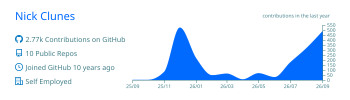
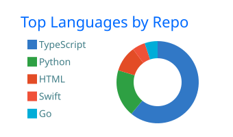
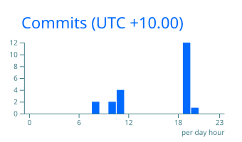

<h1 align="center">Nick Clunes</h1>

  Founder, <a href="https://digitalbrokerlabs.dev">Digital Broker Labs</a> · Sydney 
  Technology that gives Australian mortgage brokers a technical edge.

  <a href="https://digitalbrokerlabs.dev">digitalbrokerlabs.dev</a> ·
  <a href="https://myloanbook.au">myloanbook.au</a> ·
  <a href="https://linkedin.com/in/nickclunes">LinkedIn</a>

 

### What I build

- **For brokers and brokerages:** trail, clawback and repricing intelligence, compliance file automation, servicing and lodgement tooling. Software a brokerage owns outright.
- **For licensees, lenders, mortgage managers and aggregators:** platforms, portals, document pipelines and integrations.
- **How:** AI coding agents assist with the boiler plate, scaffolding, tests and first drafts. Every line that ships is reviewed by me, with business logic remaining private. Product cores never depend on a model we can't host, version or explain.

### In production

| | |
| --- | --- |
| **[MyLoanBook](https://myloanbook.au)** | Trail-book management for mortgage brokers: at-risk alerts, clawback exposure, repricing workflows, book valuation. Deterministic engines on PostgreSQL with row-level security and mandatory MFA. No LLM in the product. |
| **Internal tooling** | LoanCompli (compliance document extraction, on-device models) and Commercial PowerHub (18-scenario commercial servicing) run our own operations. Not for sale. |

### Principles

1. Your data runs where your model runs: in Australia, on infrastructure you can name.
2. Rented models are swappable parts, never the engine.
3. The unit price falls, the bill rises. Budget tokens per task, not price per token.
4. Speed comes from agents. Accountability comes from a named engineer.

### Stack

`TypeScript` `Next.js` `React` `PostgreSQL` `Supabase` `Python` `Swift / SwiftUI` `Qdrant` `Ollama` `Docker` `Vercel (Sydney)`

### Activity

  
  

Most of the work is in private repositories. The charts include private activity as aggregate numbers only.

### Public tools

- [SimpleBID](https://github.com/AsusGuy/SimpleBID): desktop tool that drafts Best Interests Duty notes.
- [CommercialServicing](https://github.com/AsusGuy/CommercialServicing): runs 18 commercial servicing scenarios at once, full-doc versus lease-doc with rate stress.
- [Purchase-Price-Calculator](https://github.com/AsusGuy/Purchase-Price-Calculator): maximum purchase price from deposit and borrowing capacity, with NSW stamp duty, first-home-buyer concessions and LMI.
