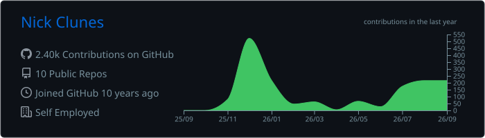
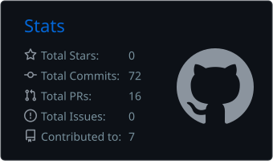
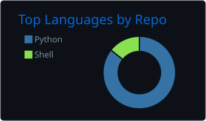
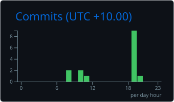
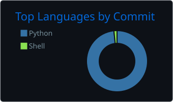

## Nick Clunes

Founder, [Digital Broker Labs](https://digitalbrokerlabs.dev): technology that gives Australian mortgage brokers a technical edge, and the same engineering for licensees, lenders, mortgage managers and aggregators. 

**Stack:** TypeScript · Next.js · PostgreSQL · Supabase · Python · Swift
**In production:** [MyLoanBook](https://myloanbook.au), trail-book management for brokers. Internal tooling for compliance files and commercial servicing.

---

## 📊 GitHub at a Glance

---

## 🧮 Stats & Languages

  
  

---

## 🏆 Trophies

---

## ⏱️ Productivity Patterns

  
  

---

Cards regenerate daily via <a href="https://github.com/vn7n24fzkq/github-profile-summary-cards">github-profile-summary-cards</a>. Private-repo activity is included as aggregate numbers only; no repo names are exposed.
